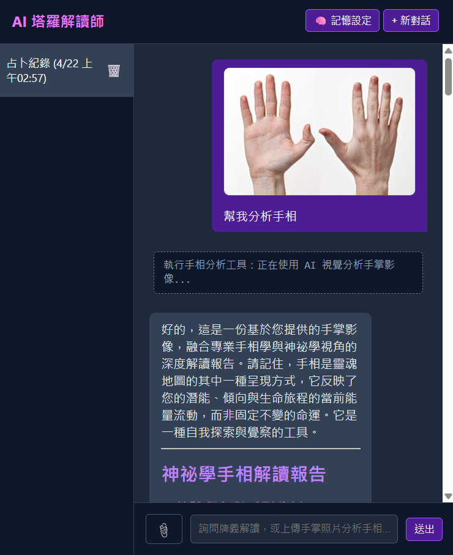
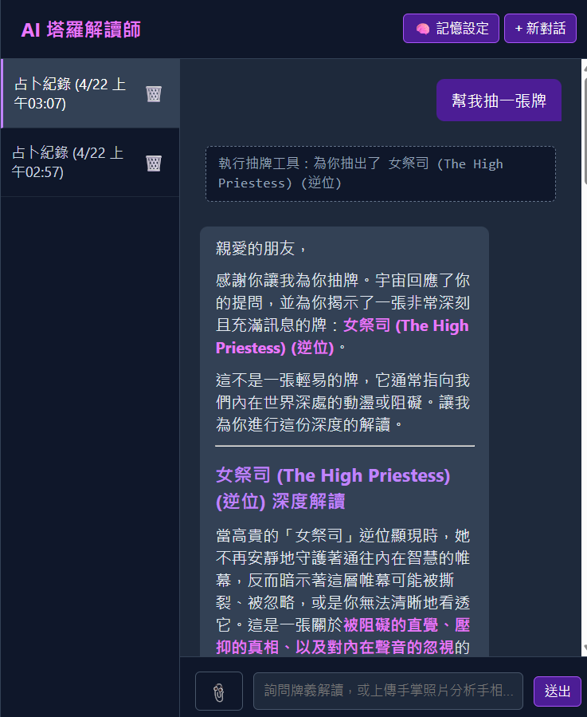

# 作業：設計 Skill + 打造 AI 聊天機器人

> **繳交方式**：將你的 GitHub repo 網址貼到作業繳交區
> **作業性質**：個人作業

---

## 作業目標

使用 Antigravity Skill 引導 AI，完成一個具備前後端的 AI 聊天機器人。
重點不只是「讓程式跑起來」，而是透過設計 Skill，學會用結構化的方式與 AI 協作開發。

---

## 繳交項目

你的 GitHub repo 需要包含以下內容：

### 1. Skill 設計（`.agents/skills/`）

為以下五個開發階段＋提交方式各設計一個 SKILL.md：

| 資料夾名稱        | 對應指令          | 說明                                                                           |
| ----------------- | ----------------- | ------------------------------------------------------------------------------ |
| `prd/`          | `/prd`          | 產出 `docs/PRD.md`                                                           |
| `architecture/` | `/architecture` | 產出 `docs/ARCHITECTURE.md`                                                  |
| `models/`       | `/models`       | 產出 `docs/MODELS.md`                                                        |
| `implement/`    | `/implement`    | 產出程式碼（**需指定**：HTML 前端 + Flask + SQLite 後端）                     |
| `test/`         | `/test`         | 產出手動測試清單                                                               |
| `commit/`       | `/commit`       | 自動 commit + push（**需指定**：使用者與 email 使用 Antigravity 預設值） |

#### 額外自訂 Skill

| 資料夾名稱                 | 對應指令          | 說明                                                                 |
| -------------------------- | ----------------- | -------------------------------------------------------------------- |
| `others/myskill1/`        | `/record_draws`  | 塔羅抽卡紀錄管理員：分析資料庫中的歷史抽牌紀錄，產出統計與洞察報告 |
| `others/myskill2/`        | `/palm_reading`  | 手相視覺分析師：利用 Gemini Vision 分析手掌照片，解讀掌紋特徵並提供運勢建議 |

### 2. 開發文件（`docs/`）

用你設計的 Skill 產出的文件，需包含：

- `docs/PRD.md`
- `docs/ARCHITECTURE.md`
- `docs/MODELS.md`

### 3. 程式碼

一個可執行的 AI 聊天機器人，需支援以下功能：

| 功能           | 說明                                                | 是否完成 |
| -------------- | --------------------------------------------------- | -------- |
| 對話狀態管理   | 使用 SQLite 支援多聊天室（session），維持上下文     | ✅       |
| 訊息系統       | 訊息結構包含 role、content、image_path、timestamp   | ✅       |
| 對話歷史管理   | 側邊欄顯示歷史紀錄，可建立、切換與刪除對話         | ✅       |
| 上傳圖片或文件 | 📎 上傳圖片後預覽，傳送給 Gemini 視覺分析（手相等）| ✅       |
| 回答控制       | 支援重新生成（🔄）與中止回應（⏹️ AbortController） | ✅       |
| 記憶機制       | 🧠 全域偏好設定，跨對話注入 system_instruction      | ✅       |
| 工具整合       | 關鍵字觸發 draw_tarot_card() 自動抽牌並由 AI 解讀  | ✅       |

#### 功能說明

- **對話狀態管理**：使用 Flask-SQLAlchemy 搭配 SQLite，透過 `ChatSession` 與 `ChatMessage` 模型實現多聊天室與訊息持久化。
- **訊息系統**：每則訊息皆包含 `role`（user / assistant / system / tool）、`content`、`image_path`、`created_at` 等欄位。
- **對話歷史管理**：左側面板顯示所有歷史對話紀錄，支援建立、切換與刪除。
- **上傳圖片或文件**：點擊 📎 按鈕可上傳圖片（png/jpg/gif/webp）或文件（pdf/txt），圖片會在輸入框上方預覽，送出後會顯示在對話氣泡中，並傳送給 Gemini 進行視覺分析。
- **🖐️ 手相分析**：上傳手掌照片後，AI 會自動偵測意圖並啟動手相分析工具，利用 Gemini 的視覺能力解讀生命線、智慧線、感情線等掌紋特徵，提供完整的手相報告。
- **回答控制**：送出訊息後按鈕自動切換為「⏹️ 中止」模式（使用 AbortController）；AI 回覆下方提供「🔄 重新生成」按鈕。
- **記憶機制**：透過「🧠 記憶設定」Modal 設定個人偏好，儲存於 `UserPreference` 模型中，所有對話共享。記憶內容會被注入 Gemini 的 `system_instruction`。
- **工具整合**：實作規則引擎偵測使用者意圖（關鍵字：「抽牌」），自動呼叫 `draw_tarot_card()` 內部工具進行隨機抽牌，並將結果交由 Gemini 進行解讀。

### 4. 系統截圖（`screenshots/`）

在 `screenshots/` 資料夾放入以下截圖：

- `chat.png`：聊天機器人主畫面，**需包含至少一輪完整的對話**


- `history.png`：對話歷史或多 session 切換的畫面


---

## 專案結構

```
your-repo/
├── .agents/
│   └── skills/
│       ├── prd/SKILL.md
│       ├── architecture/SKILL.md
│       ├── models/SKILL.md
│       ├── implement/SKILL.md
│       ├── test/SKILL.md
│       ├── commit/SKILL.md
│       └── others/
│           ├── myskill1/SKILL.md      ← 自訂技能：抽卡紀錄管理員
│           └── myskill2/SKILL.md      ← 自訂技能：手相視覺分析師
├── docs/
│   ├── PRD.md
│   ├── ARCHITECTURE.md
│   └── MODELS.md
├── templates/
│   └── index.html                     ← 前端頁面（含聊天 UI 與記憶設定 Modal）
├── static/
│   ├── css/
│   │   └── style.css                  ← 暗色主題 UI 樣式
│   └── js/
│       ├── app.js                     ← 塔羅抽籤邏輯
│       └── chat.js                    ← 聊天室前端邏輯（含 Abort / Regenerate / Memory）
├── data/
│   └── tarot.json                     ← 塔羅牌資料集
├── tests/
│   └── test_app.py                    ← 自動化測試
├── screenshots/
│   ├── chat.png
│   └── history.png
├── app.py                             ← Flask 後端（含 Gemini 串接、Tool Use、Memory API）
├── requirements.txt
├── .env.example                       ← 環境變數範本
├── .gitignore
└── README.md                          ← 本檔案（含心得報告）
```

---

## 技術棧

| 類別     | 技術                                           |
| -------- | ---------------------------------------------- |
| 後端框架 | Flask + Flask-SQLAlchemy                       |
| 資料庫   | SQLite（透過 SQLAlchemy ORM）                  |
| AI 模型  | Google Gemini 2.5 Flash（`google-generativeai`）|
| 前端     | HTML + Vanilla CSS + JavaScript                |
| Markdown | marked.js（AI 回覆的 Markdown 渲染）          |
| 測試     | pytest                                         |

---

## 啟動方式

```bash
# 1. 建立虛擬環境
python -m venv .venv
.venv\Scripts\activate        # macOS/Linux: source .venv/bin/activate

# 2. 安裝套件
pip install -r requirements.txt

# 3. 設定環境變數
copy .env.example .env        # macOS/Linux: cp .env.example .env
# 編輯 .env，填入你的 GEMINI_API_KEY

# 4. 啟動伺服器
python app.py
# 開啟瀏覽器：http://localhost:5000
```

> **注意**：若未設定 `GEMINI_API_KEY`，系統會自動退回「模擬回覆」模式，仍可正常使用所有 UI 功能。

---

## 心得報告

**姓名**：江庭翔
**學號**：D1188863

### 問題與反思

**Q1. 你設計的哪一個 Skill 效果最好？為什麼？哪一個效果最差？你認為原因是什麼？**
 
> 我覺得效果最好的是myskill2因為他可以利用gemini的視覺能力分析手掌照片，是我原本沒有想到的
> 我覺得效果最差的是myskill1，因為它害我出現bug

---

**Q2. 在用 AI 產生程式碼的過程中，你遇到什麼問題是 AI 沒辦法自己解決、需要你介入處理的？**

> api餘額不足
